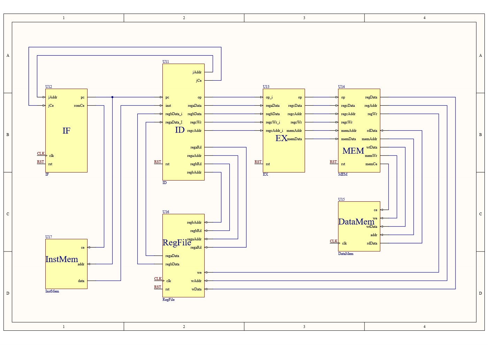

# 总体概述

1. 为了加深自己对`CPU`的认识以及完成***计算机组成原理***这门课程的任务要求，使用`Verilog`实现`MIPS CPU`的设计。
2. 整个过程从简单到复杂，每个版本单独占用一个目录。
3. 开发环境使用在`Deepin20`下使用`VScode`、`iverilog`、`GTKWave`、`QtSpim`

# 目录

- [总体概述](#总体概述)
- [目录](#目录)
- [版本简介](#版本简介)
	- [Version 1](#version-1)
		- [说明](#说明)
		- [原理图](#原理图)
	- [Version 2](#version-2)
		- [说明](#说明-1)
		- [原理图](#原理图-1)
	- [Version 3](#version-3)
		- [说明](#说明-2)
		- [原理图](#原理图-2)
	- [Version 4](#version-4)
		- [说明](#说明-3)
		- [原理图](#原理图-3)
	- [Version 5](#version-5)
		- [说明](#说明-4)
		- [原理图](#原理图-4)
	- [Version 6](#version-6)
		- [说明](#说明-5)
		- [原理图](#原理图-5)

# 版本简介

## Version 1

### 说明

1. 仅完成最基础的框架
2. 仅支持基础的**R型**和**I型**指令

### 原理图

## Version 2

### 说明

1. 在`Version 1`的基础上加入了对**跳转(J型)指令**的支持

### 原理图

## Version 3

### 说明

1. 在`Version 2`的基础上增加了`MEM`(存储管理)模块，用于区分`RegFile`和`DataMem`
2. 使用**哈佛结构**，**指令存储**和**数据存储**分开
3. 增加对*lw*指令和*sw*指令的支持

### 原理图

## Version 4

### 说明

1. 在`Version 3`的基础上增加了`MIOC`模块，用于区分`DataMem`和`IO`
2. 完善**20条MIPS整数指令**

### 原理图

## Version 5

### 说明

1. 在`Version 4`的基础上增加对**MIPS12条整数指令**的支持
2. 添加`HI/LO`模块

### 原理图

## Version 6

### 说明

1. 在`Version 5`的基础上增加**GPIO**通用输入输出模块

### 原理图

